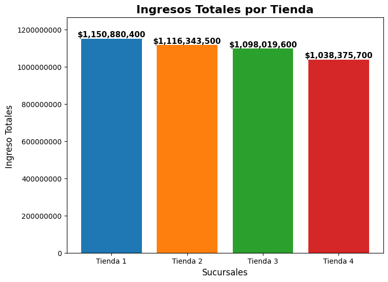
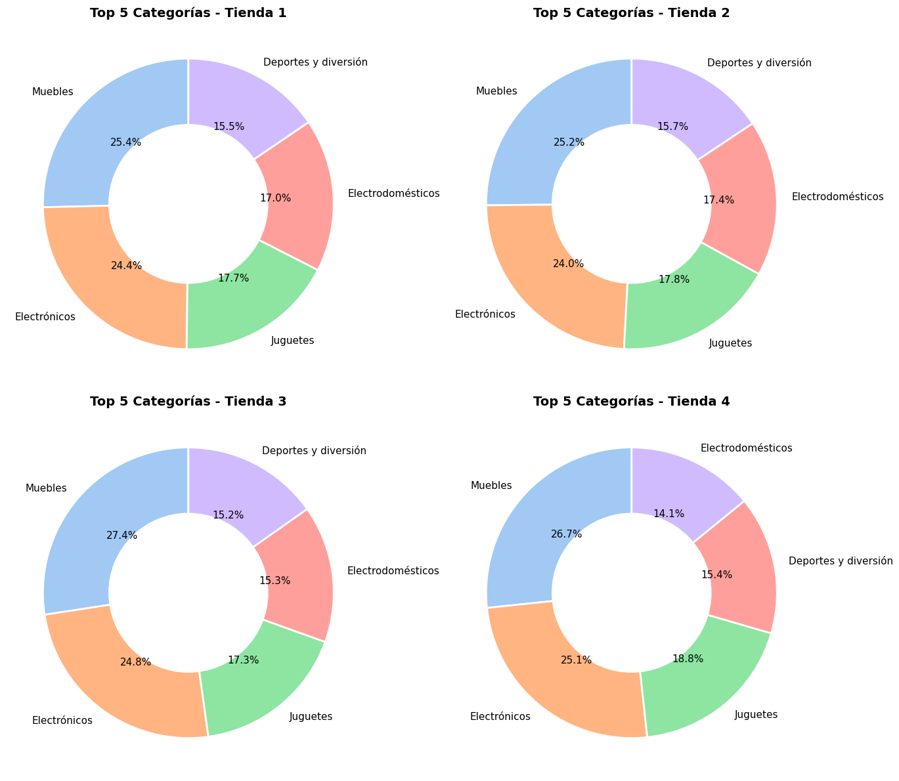
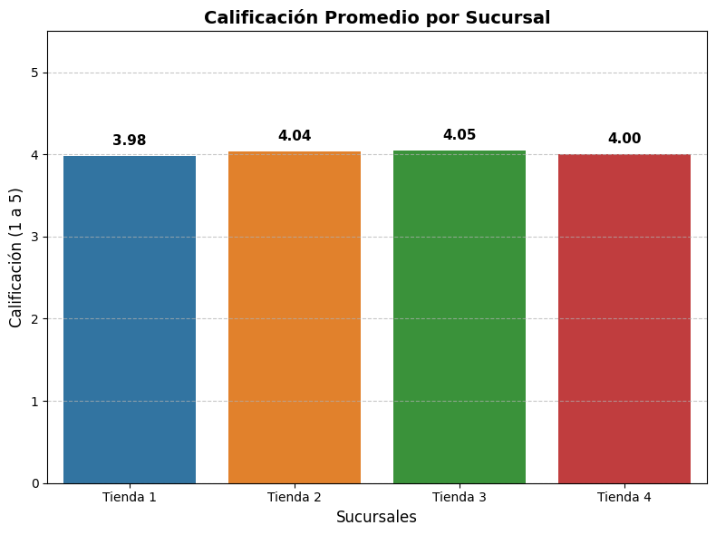
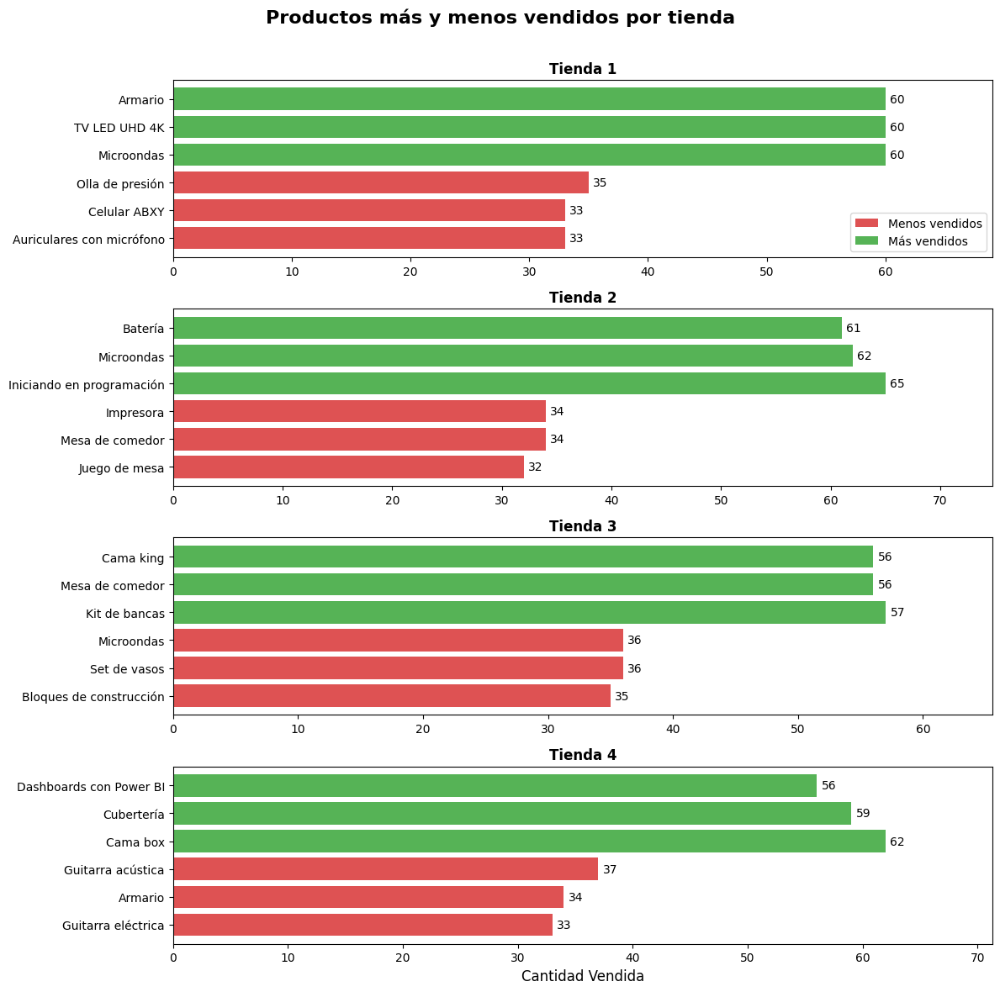
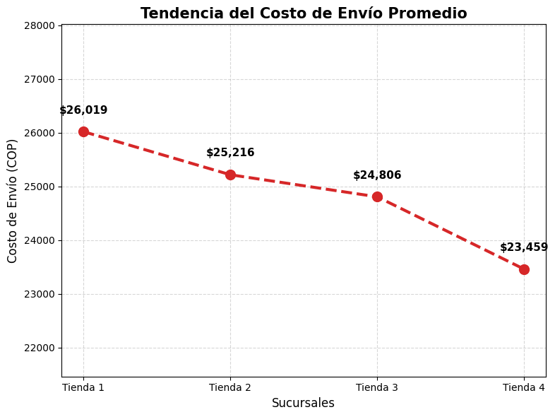

# Challenge_Alura_Store
Desafío para desarrollar tus habilidades en análisis de datos con Python y manipulación de datos. 

# 📊 Data Science Challenge: Optimización de "Alura Store"

## 🎯 Propósito del Proyecto
Este proyecto simula una consultoría de datos para el CEO de **Alura Store**. El objetivo es identificar, mediante el análisis de 4 sucursales, cuál de ellas debe ser vendida para financiar un nuevo proyecto de expansión. 

El enfoque principal fue transformar datos crudos en **insights de negocio** para tomar una decisión estratégica basada en evidencia y no en suposiciones.

## 📁 Estructura del Repositorio
* `AluraStoreLatam.ipynb`: Notebook principal con el ciclo completo de análisis.
* `tienda_1.csv`, `tienda_2.csv`, `tienda_3.csv`, `tienda_4.csv`: Bases de datos con registros de productos, precios, categorías, costos de envío y calificaciones.
* `README.md`: Documentación del proyecto.

## ⚙️ Proceso de Análisis y Visualización

El análisis se estructuró en 5 dimensiones críticas:

### 1. Análisis de Facturación (Ingresos Totales)
Se calculó el ingreso total por tienda para entender el impacto financiero de cada una.
* **Técnica:** Agregación de precios por sucursal.
* **Gráfico:** Barras comparativas con etiquetas de valor real.

*Aquí puedes observar la comparativa de ventas. La Tienda 4 muestra el rendimiento más bajo.*

### 2. Ventas por Categoría
Identificación de los sectores del mercado que más mueven el inventario.
* **Visualización:** Gráficos de Dona (Donut Charts) para visualizar la composición porcentual de las ventas.

*Análisis mediante gráficos de dona que muestran cómo los Muebles y Electrónicos dominan el inventario.*
### 3. Satisfacción del Cliente (Rating)
Evaluación de la calidad del servicio percibida por los compradores.
* **Métrica:** Promedio de calificación (1-5 estrellas).
* **Gráfico:** Barras con escala fija para comparar la estabilidad de la marca.

*Nivel de aceptación de los clientes (promedio de 4 estrellas).*
### 4. Productos Estrella vs. Estancados
Detección de los 3 productos con mayor y menor rotación por tienda.
* **Visualización:** Gráficos de barras horizontales de "Semaforización" (Verde para éxitos, Rojo para bajas ventas).

*Semaforización de productos estrella (verde) y productos con baja rotación (rojo).*
### 5. Logística y Costos de Envío
Análisis de la eficiencia en los costos de despacho asumidos por el cliente.
* **Gráfico:** Línea de tendencia para identificar picos de costos logísticos.

*Análisis del costo logístico por sucursal.*
## 💡 Conclusión Estratégica
Tras el cruce de variables, la recomendación final es la **venta de la Tienda 4**. 

**Justificación:** A pesar de tener los **costos de envío más competitivos (baratos)** y una satisfacción de cliente excelente (4.0 estrellas), es la tienda que **menos ingresos genera**. Esto indica que su inventario se concentra en productos de bajo valor que no logran escalar la facturación global, convirtiéndola en el activo con menor retorno de inversión.

#
